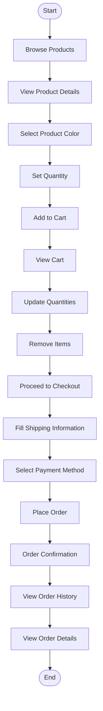
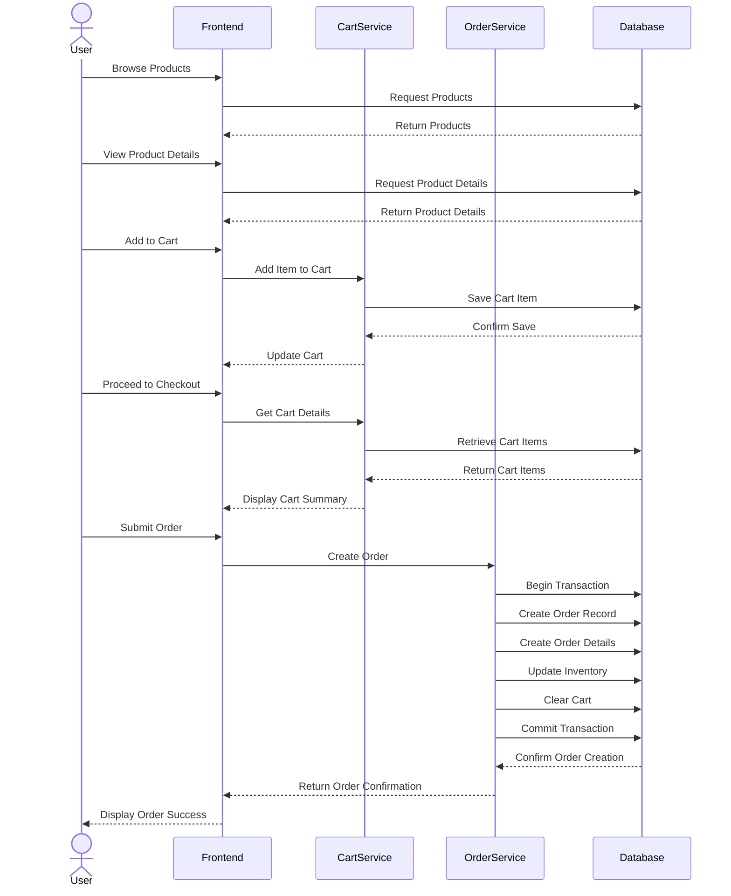

# NextGenTech Ordering Process

This document describes the complete ordering process in the NextGenTech e-commerce application, from browsing products to completing an order.

## Table of Contents
1. [Overview](#overview)
2. [Use Case Diagram](#use-case-diagram)
3. [Ordering Process Flow](#ordering-process-flow)
4. [Sequence Diagram](#sequence-diagram)
5. [Detailed Steps](#detailed-steps)

## Overview

The NextGenTech ordering system allows users to browse products, add items to their cart, proceed to checkout, and complete orders. The process involves several components working together to provide a seamless shopping experience.

## Use Case Diagram

```mermaid
graph TD
    User((User))
    Admin((Admin))
    
    subgraph "NextGenTech E-commerce System"
        BrowseProducts[Browse Products]
        ViewProductDetails[View Product Details]
        AddToCart[Add to Cart]
        ViewCart[View Cart]
        UpdateCart[Update Cart Quantities]
        RemoveFromCart[Remove Items from Cart]
        Checkout[Checkout]
        PlaceOrder[Place Order]
        ViewOrderHistory[View Order History]
        ViewOrderDetails[View Order Details]
        ManageOrders[Manage Orders]
        UpdateOrderStatus[Update Order Status]
    end
    
    User --> BrowseProducts
    User --> ViewProductDetails
    User --> AddToCart
    User --> ViewCart
    User --> UpdateCart
    User --> RemoveFromCart
    User --> Checkout
    User --> PlaceOrder
    User --> ViewOrderHistory
    User --> ViewOrderDetails
    
    Admin --> ManageOrders
    Admin --> UpdateOrderStatus
```

## Ordering Process Flow

## Sequence Diagram

## Detailed Steps

### 1. Browsing Products

Users can browse products through the following steps:

1. Navigate to the Products page (`/products`)
2. Use filters to narrow down products by:
   - Categories
   - Brands
   - Price range
3. Use search functionality to find specific products
4. Sort products by:
   - Newest
   - Price (low to high)
   - Price (high to low)
   - Highest rated

### 2. Viewing Product Details

When a user clicks on a product:

1. The application navigates to the product detail page (`/products/:id`)
2. The page displays:
   - Product images
   - Product name and description
   - Price information
   - Available colors
   - Stock information
   - Reviews and ratings

### 3. Adding to Cart

Users can add products to their cart in two ways:

1. **From Product Detail Page**:
   - Select a color
   - Set quantity
   - Click "Add to Cart" button

2. **From Product Listing**:
   - Click the cart icon on a product card
   - Select color and quantity in the modal
   - Click "Add to Cart" button

The system checks if the product is already in the cart:
- If yes, it updates the quantity
- If no, it adds a new item to the cart

### 4. Managing the Cart

In the cart page (`/cart`), users can:

1. View all items in their cart
2. Update quantities of items
3. Remove items from the cart
4. See the cart total
5. Proceed to checkout

### 5. Checkout Process

The checkout process involves:

1. Filling out shipping information:
   - Full name
   - Phone number
   - Address (city, district, ward, street address)

2. Selecting a payment method:
   - Cash on Delivery (COD)
   - MoMo
   - VNPay

3. Reviewing the order summary:
   - Items in the cart
   - Quantities
   - Prices
   - Total amount

4. Placing the order by clicking "Place Order"

### 6. Order Processing (Server-side)

When an order is placed, the server:

1. Creates a new order record with:
   - User information
   - Shipping address
   - Payment method
   - Order status (initially "Pending")

2. Creates order detail records for each item in the cart

3. Updates inventory by reducing stock quantities

4. Clears the user's cart

5. Returns order confirmation to the client

### 7. Order Confirmation

After successful order placement:

1. User is redirected to the order success page
2. Order number and total amount are displayed
3. User can continue shopping or view order history

### 8. Order History and Details

Users can:

1. View their order history (`/orderHistory`)
2. See order status (Pending, In Progress, Completed, Canceled)
3. View detailed information about each order (`/order/:orderId`)
4. Track the progress of their orders
