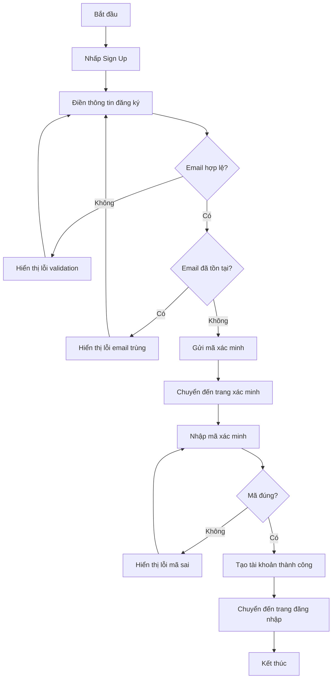
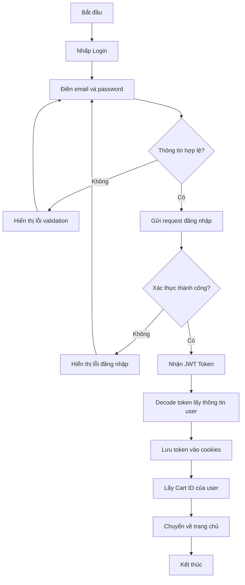
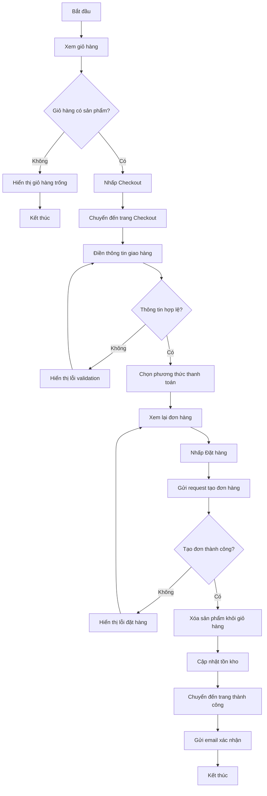
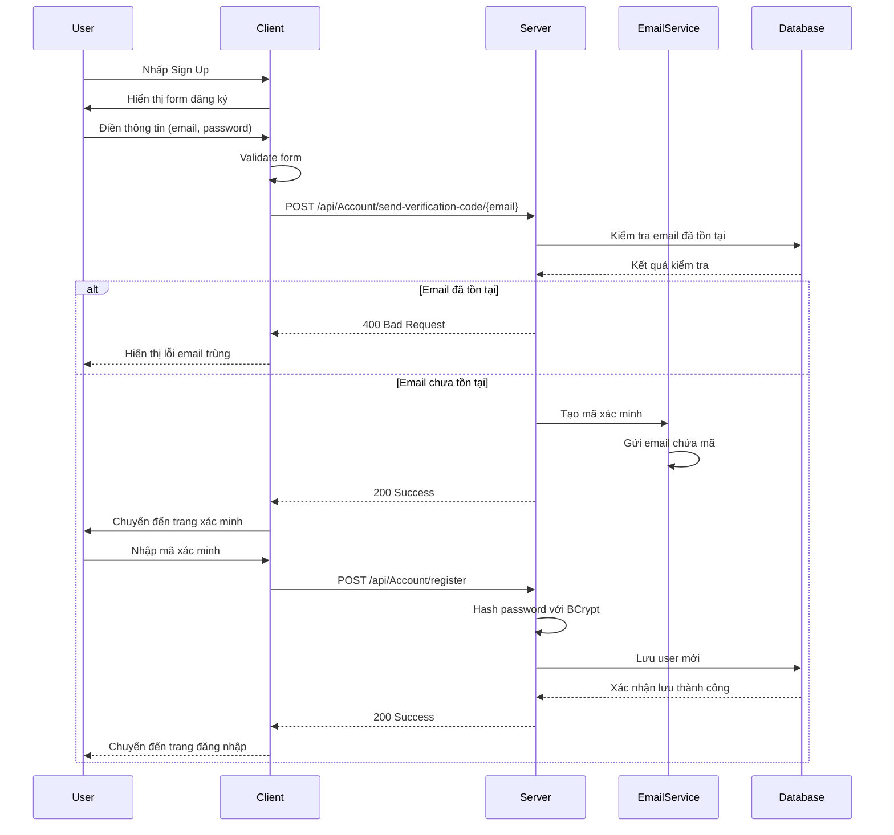
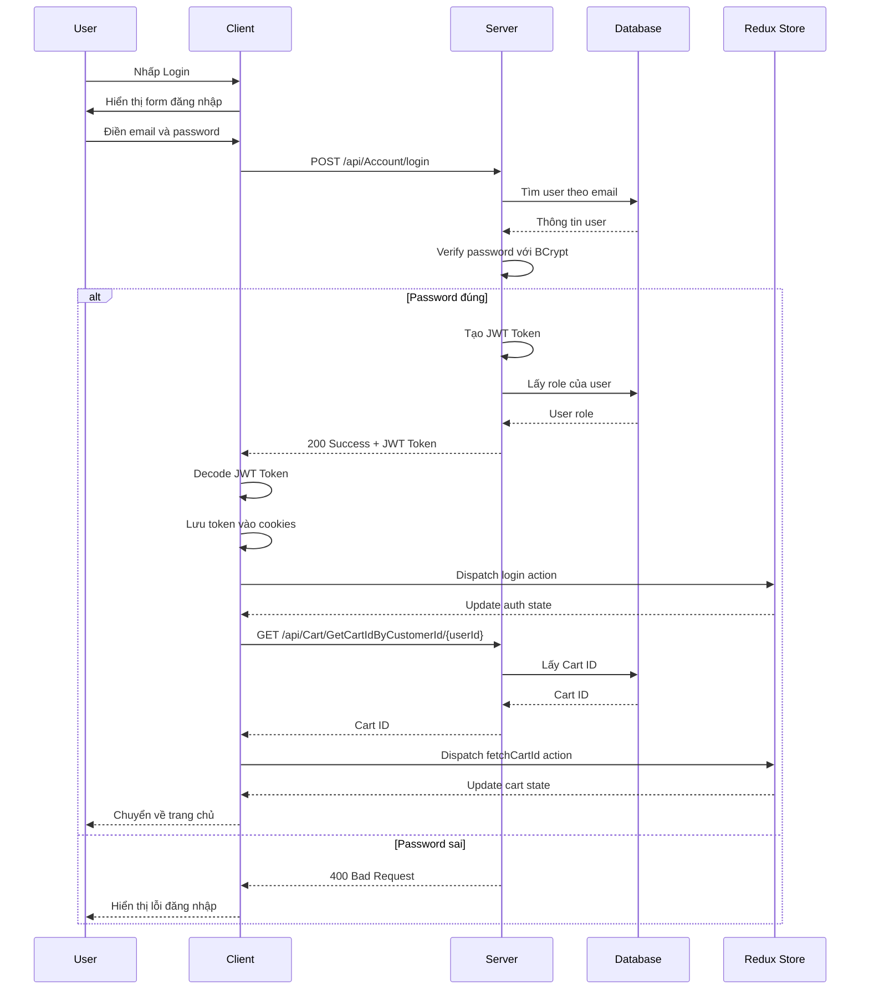
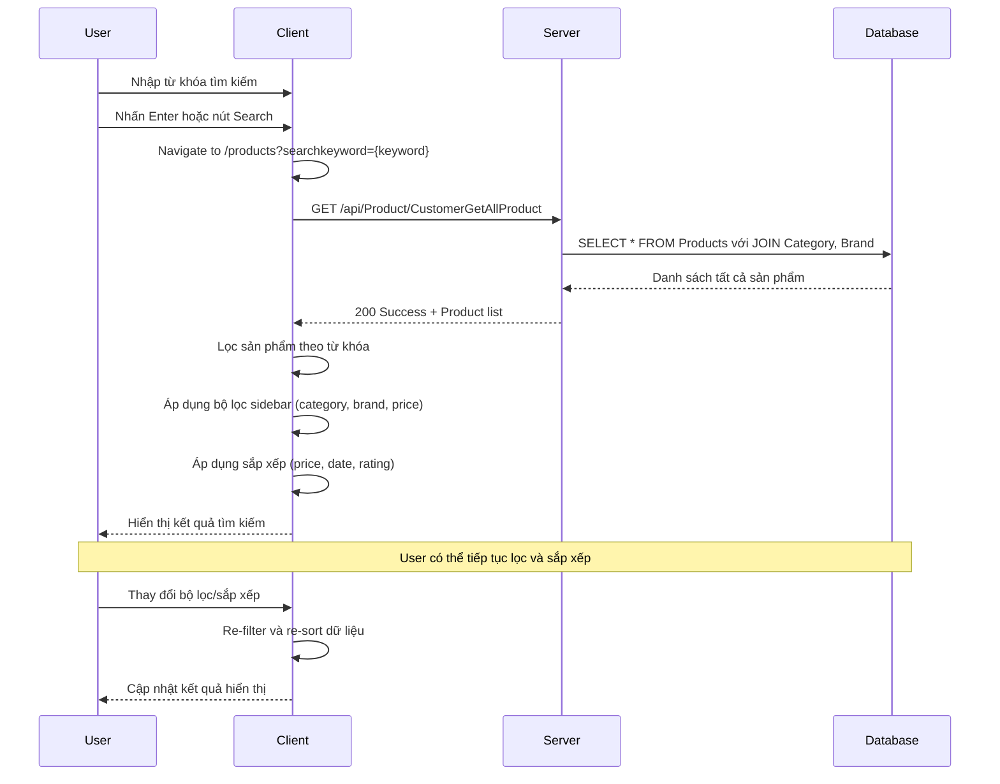
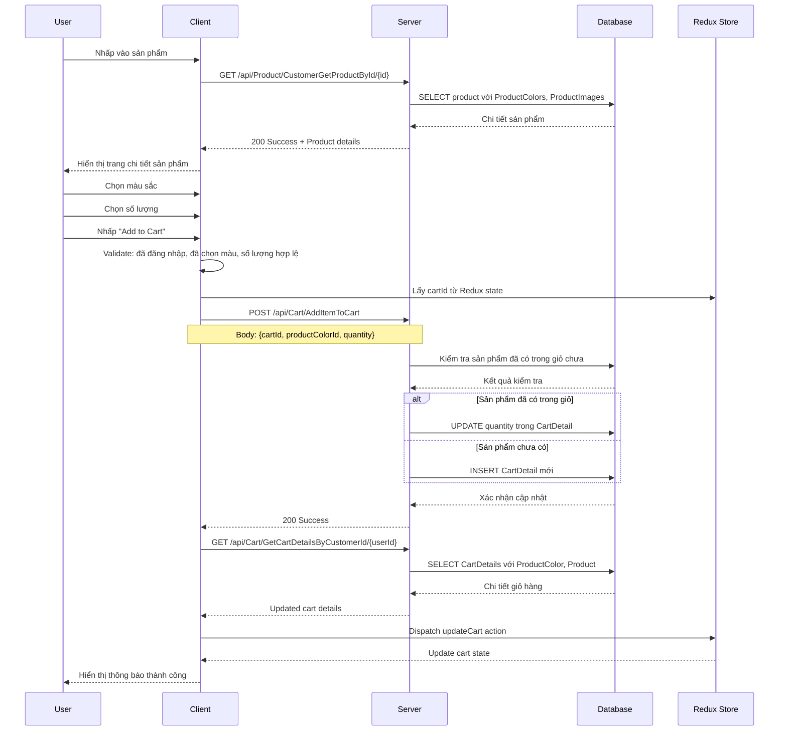
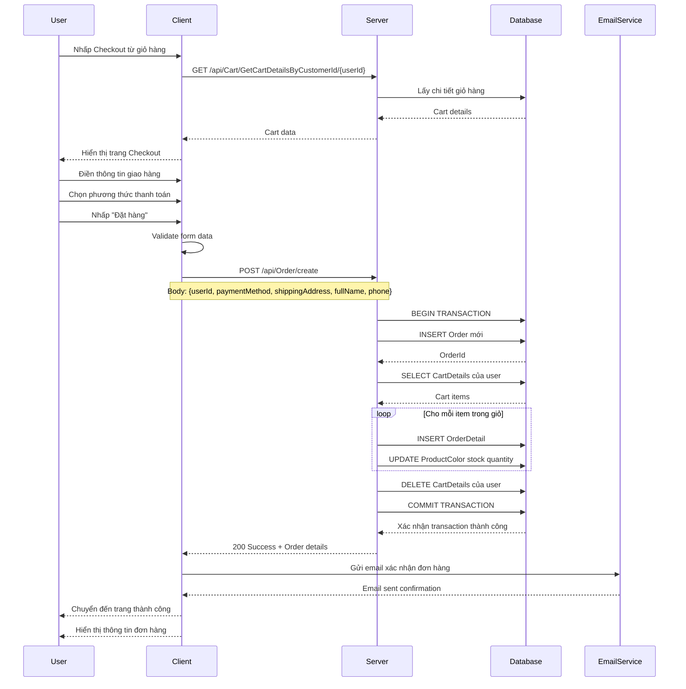
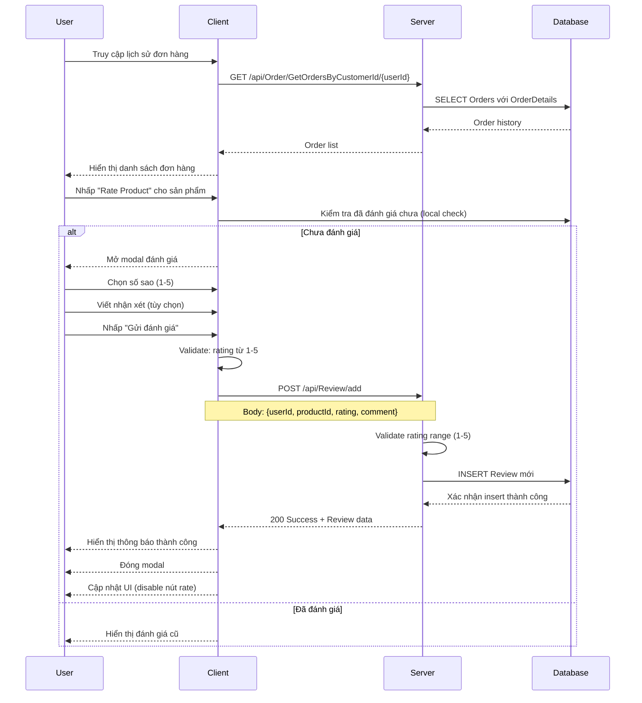

# Hướng Dẫn Sử Dụng NextGenTech - Dành Cho Người Dùng

## Mục Lục
1. [Đăng Ký/Tạo Tài Khoản và Đăng Nhập](#1-đăng-ký-tạo-tài-khoản-và-đăng-nhập)
2. [Tìm Kiếm và Duyệt Sản Phẩm](#2-tìm-kiếm-và-duyệt-sản-phẩm)
3. [Xem Chi Tiết Sản Phẩm](#3-xem-chi-tiết-sản-phẩm)
4. [Giỏ Hàng và Đặt Hàng](#4-giỏ-hàng-và-đặt-hàng)
5. [Đánh Giá và Bình Chọn](#5-đánh-giá-và-bình-chọn)
6. [Sơ Đồ Flowchart](#6-sơ-đồ-flowchart)
7. [Sơ Đồ Sequence](#7-sơ-đồ-sequence)

---

## 1. Đăng Ký/Tạo Tài Khoản và Đăng Nhập

### 1.1 Đăng Ký Tài Khoản

#### Các Bước Thực Hiện:
1. **Truy cập trang đăng ký**: Nhấp vào nút "Sign Up" trên thanh navigation
2. **Điền thông tin**:
   - Email (bắt buộc)
   - Mật khẩu (bắt buộc, tối thiểu 6 ký tự)
   - Xác nhận mật khẩu
3. **Gửi mã xác minh**: Hệ thống sẽ gửi mã xác minh 6 chữ số đến email
4. **Xác minh email**: Nhập mã xác minh để hoàn tất đăng ký
5. **Hoàn tất**: Tài khoản được tạo thành công

#### API Endpoints:
- `POST /api/Account/send-verification-code/{email}` - Gửi mã xác minh
- `POST /api/Account/register` - Đăng ký tài khoản

#### Validation:
- Email phải có định dạng hợp lệ
- Email không được trùng với tài khoản đã tồn tại
- Mật khẩu được mã hóa bằng BCrypt

### 1.2 Đăng Nhập

#### Các Bước Thực Hiện:
1. **Truy cập trang đăng nhập**: Nhấp vào nút "Login" trên thanh navigation
2. **Điền thông tin**:
   - Email
   - Mật khẩu
3. **Xác thực**: Hệ thống kiểm tra thông tin đăng nhập
4. **Nhận JWT Token**: Sau khi đăng nhập thành công, nhận token để xác thực
5. **Chuyển hướng**: Được chuyển về trang chủ

#### API Endpoints:
- `POST /api/Account/login` - Đăng nhập

#### Luồng Xử Lý:
```javascript
// Redux action cho đăng nhập
const login = createAsyncThunk('Auth/Login', async (credentials) => {
  const response = await api.post('/api/Account/login', credentials);
  const { jwtToken } = response.data;

  // Decode token để lấy thông tin user
  const decodedToken = jwtDecode(jwtToken);
  const userId = decodedToken.sub;
  const userRole = decodedToken["http://schemas.microsoft.com/ws/2008/06/identity/claims/role"];

  // Lưu vào cookies
  setAuthCookies(userId, jwtToken, userRole);
  return response.data;
});
```

---

## 2. Tìm Kiếm và Duyệt Sản Phẩm

### 2.1 Duyệt Sản Phẩm

#### Trang Chủ (Home):
- **Sản phẩm nổi bật**: Hiển thị 8 sản phẩm đầu tiên
- **Thương hiệu nổi bật**: Apple, Sony, Razer, SoundCore
- **Danh mục sản phẩm**: Headphone, Keyboard, Mouse, Phone, Speaker

#### Trang Sản Phẩm (Products):
- **Hiển thị tất cả sản phẩm**: Lấy từ API `/api/Product/CustomerGetAllProduct`
- **Bộ lọc sidebar**:
  - Theo danh mục (Category)
  - Theo thương hiệu (Brand)
  - Theo khoảng giá
  - Theo đánh giá
- **Sắp xếp**:
  - Mới nhất
  - Giá thấp đến cao
  - Giá cao đến thấp
  - Đánh giá cao nhất

### 2.2 Tìm Kiếm Sản Phẩm

#### Thanh Tìm Kiếm:
- **Vị trí**: Trên thanh navigation
- **Chức năng**: Tìm kiếm theo tên sản phẩm
- **URL**: `/products?searchkeyword={keyword}`

#### Luồng Tìm Kiếm:
```javascript
const handleSearch = (searchValue) => {
  navigate(`/products?searchkeyword=${encodeURIComponent(searchValue)}`);
};
```

### 2.3 Hiển Thị Sản Phẩm

#### Thông Tin Hiển Thị:
- Hình ảnh sản phẩm (placeholder từ Picsum)
- Tên sản phẩm
- Giá gốc và giá khuyến mãi
- Đánh giá sao (random 2-5 sao)
- Danh mục và thương hiệu
- Ngày thêm sản phẩm

#### API Response Structure:
```json
{
  "productId": 1,
  "name": "iPhone 15 Pro",
  "price": 25000000,
  "salePrice": 23000000,
  "category": {
    "categoryId": 1,
    "categoryName": "Smartphone"
  },
  "brand": {
    "brandId": 1,
    "brandName": "Apple"
  },
  "createdAt": "2024-01-01T00:00:00Z"
}
```

---

## 3. Xem Chi Tiết Sản Phẩm

### 3.1 Thông Tin Chi Tiết

#### Các Thành Phần:
1. **Carousel hình ảnh**: Hiển thị nhiều hình ảnh sản phẩm
2. **Thông tin cơ bản**:
   - Tên sản phẩm
   - Giá và giá khuyến mãi
   - Mô tả ngắn và mô tả chi tiết
   - Đánh giá trung bình
3. **Tùy chọn sản phẩm**:
   - Chọn màu sắc (với mã màu)
   - Chọn số lượng
   - Kiểm tra tồn kho
4. **Nút hành động**:
   - Thêm vào giỏ hàng
   - Quay lại trang sản phẩm

### 3.2 API Endpoint

#### Lấy Chi Tiết Sản Phẩm:
- `GET /api/Product/CustomerGetProductById/{id}`

#### Response Structure:
```json
{
  "productId": 1,
  "name": "iPhone 15 Pro",
  "description": "Mô tả ngắn",
  "longDescription": "Mô tả chi tiết",
  "price": 25000000,
  "salePrice": 23000000,
  "stockQuantity": 100,
  "category": {...},
  "brand": {...},
  "productImages": [
    {
      "imageUrl": "https://example.com/image1.jpg",
      "isPrimary": true
    }
  ],
  "productColors": [
    {
      "productColorId": 1,
      "color": "Space Black",
      "colorCode": "#1a1a1a",
      "stockQuantity": 50
    }
  ]
}
```

### 3.3 Thêm Vào Giỏ Hàng

#### Luồng Xử Lý:
1. **Kiểm tra đăng nhập**: User phải đăng nhập
2. **Chọn màu sắc**: Bắt buộc chọn màu
3. **Kiểm tra tồn kho**: Số lượng không vượt quá tồn kho
4. **Gửi request**: Thêm vào giỏ hàng qua API
5. **Cập nhật UI**: Hiển thị thông báo thành công

```javascript
const handleAddToCart = async () => {
  const cartData = {
    cartId: cartId,
    productColorId: selectedColor.productColorId,
    quantity: quantity
  };

  await dispatch(addItemToCart(cartData));
  message.success("Đã thêm sản phẩm vào giỏ hàng!");
};
```

---

## 4. Giỏ Hàng và Đặt Hàng

### 4.1 Quản Lý Giỏ Hàng

#### Chức Năng Giỏ Hàng:
1. **Hiển thị sản phẩm**: Danh sách sản phẩm đã thêm
2. **Cập nhật số lượng**: Tăng/giảm số lượng sản phẩm
3. **Xóa sản phẩm**: Loại bỏ sản phẩm khỏi giỏ
4. **Tính tổng tiền**: Tự động tính tổng giá trị đơn hàng
5. **Làm mới giỏ hàng**: Đồng bộ với server

#### API Endpoints:
- `GET /api/Cart/GetCartIdByCustomerId/{customerId}` - Lấy Cart ID
- `GET /api/Cart/GetCartDetailsByCustomerId/{customerId}` - Lấy chi tiết giỏ hàng
- `POST /api/Cart/AddItemToCart` - Thêm sản phẩm
- `PUT /api/Cart/UpdateItemInCart` - Cập nhật số lượng
- `DELETE /api/Cart/DeleteItemFromCart/{cartDetailId}` - Xóa sản phẩm

### 4.2 Quy Trình Đặt Hàng

#### Bước 1: Kiểm Tra Giỏ Hàng
- Xác nhận sản phẩm trong giỏ
- Kiểm tra tồn kho
- Tính tổng tiền

#### Bước 2: Điền Thông Tin Giao Hàng
- Họ tên người nhận
- Số điện thoại
- Địa chỉ giao hàng
- Phương thức thanh toán

#### Bước 3: Xác Nhận Đơn Hàng
- Xem lại thông tin
- Áp dụng mã giảm giá (nếu có)
- Xác nhận đặt hàng

#### Bước 4: Tạo Đơn Hàng
- API: `POST /api/Order/create`
- Chuyển sản phẩm từ giỏ hàng sang đơn hàng
- Cập nhật tồn kho
- Gửi email xác nhận

### 4.3 Cấu Trúc Đơn Hàng

#### Request DTO:
```json
{
  "userId": 1,
  "paymentMethod": "COD",
  "promotionId": null,
  "shippingAddress": "123 Nguyễn Văn A, Q1, TP.HCM",
  "fullName": "Nguyễn Văn A",
  "phone": "0901234567"
}
```

#### Response:
```json
{
  "orderId": 1,
  "userId": 1,
  "orderDate": "2024-01-01T10:00:00Z",
  "totalAmount": 23000000,
  "status": "Pending",
  "paymentMethod": "COD",
  "shippingAddress": "123 Nguyễn Văn A, Q1, TP.HCM",
  "fullName": "Nguyễn Văn A",
  "phone": "0901234567",
  "orderDetails": [...]
}
```

---

## 5. Đánh Giá và Bình Chọn

### 5.1 Hệ Thống Đánh Giá

#### Điều Kiện Đánh Giá:
- User phải đăng nhập
- Chỉ đánh giá được sản phẩm đã mua
- Mỗi sản phẩm chỉ đánh giá 1 lần

#### Thông Tin Đánh Giá:
- **Rating**: 1-5 sao (bắt buộc)
- **Comment**: Nhận xét chi tiết (tùy chọn)
- **Thời gian**: Tự động ghi nhận
- **User**: Tự động lấy từ session

### 5.2 Quy Trình Đánh Giá

#### Bước 1: Truy Cập Modal Đánh Giá
- Từ trang lịch sử đơn hàng
- Nhấp vào nút "Rate Product"

#### Bước 2: Điền Thông Tin
- Chọn số sao (1-5)
- Viết nhận xét (tùy chọn)

#### Bước 3: Gửi Đánh Giá
- Validation: Kiểm tra rating hợp lệ
- API: `POST /api/Review/add`
- Hiển thị thông báo thành công

### 5.3 API Đánh Giá

#### Request DTO:
```json
{
  "userId": 1,
  "productId": 1,
  "rating": 5,
  "comment": "Sản phẩm rất tốt, đáng tiền!"
}
```

#### Validation:
- Rating: 1 ≤ rating ≤ 5
- UserId: Phải tồn tại và đăng nhập
- ProductId: Phải tồn tại trong hệ thống

#### Response:
```json
{
  "status": "success",
  "message": "Đánh giá đã được gửi",
  "data": {
    "reviewId": 1,
    "userId": 1,
    "productId": 1,
    "rating": 5,
    "comment": "Sản phẩm rất tốt, đáng tiền!",
    "createdAt": "2024-01-01T10:00:00Z"
  }
}
```

### 5.4 Hiển Thị Đánh Giá

#### Trên Trang Sản Phẩm:
- Đánh giá trung bình (tính từ tất cả reviews)
- Số lượng đánh giá
- Danh sách các đánh giá chi tiết

#### Trên Card Sản Phẩm:
- Hiển thị rating trung bình
- Số sao được tô màu vàng
- Hiển thị số rating (ví dụ: 4.5)

---

## 6. Sơ Đồ Flowchart

### 6.1 Flowchart Đăng Ký Tài Khoản



### 6.2 Flowchart Đăng Nhập



### 6.3 Flowchart Tìm Kiếm Sản Phẩm

```mermaid
flowchart TD
    A[Bắt đầu] --> B[Nhập từ khóa tìm kiếm]
    B --> C{Từ khóa rỗng?}
    C -->|Có| D[Không thực hiện gì]
    D --> A
    C -->|Không| E[Chuyển đến trang Products]
    E --> F[Gọi API lấy tất cả sản phẩm]
    F --> G[Lọc sản phẩm theo từ khóa]
    G --> H{Có sản phẩm nào?}
    H -->|Không| I[Hiển thị "Không tìm thấy"]
    H -->|Có| J[Hiển thị danh sách sản phẩm]
    J --> K[Áp dụng bộ lọc sidebar]
    K --> L[Áp dụng sắp xếp]
    L --> M[Hiển thị kết quả cuối cùng]
    I --> M
    M --> N[Kết thúc]
```

### 6.4 Flowchart Thêm Sản Phẩm Vào Giỏ Hàng

```mermaid
flowchart TD
    A[Bắt đầu] --> B[Xem chi tiết sản phẩm]
    B --> C{User đã đăng nhập?}
    C -->|Không| D[Chuyển đến trang đăng nhập]
    D --> E[Đăng nhập thành công]
    E --> B
    C -->|Có| F[Chọn màu sắc]
    F --> G{Đã chọn màu?}
    G -->|Không| H[Hiển thị lỗi "Chọn màu"]
    H --> F
    G -->|Có| I[Chọn số lượng]
    I --> J{Số lượng hợp lệ?}
    J -->|Không| K[Hiển thị lỗi số lượng]
    K --> I
    J -->|Có| L{Đủ tồn kho?}
    L -->|Không| M[Hiển thị lỗi hết hàng]
    M --> I
    L -->|Có| N[Gửi request thêm vào giỏ]
    N --> O{Thêm thành công?}
    O -->|Không| P[Hiển thị lỗi server]
    P --> N
    O -->|Có| Q[Cập nhật giỏ hàng trong Redux]
    Q --> R[Hiển thị thông báo thành công]
    R --> S[Kết thúc]
```

### 6.5 Flowchart Đặt Hàng



### 6.6 Flowchart Đánh Giá Sản Phẩm

```mermaid
flowchart TD
    A[Bắt đầu] --> B[Xem lịch sử đơn hàng]
    B --> C[Chọn sản phẩm cần đánh giá]
    C --> D{Đã đánh giá trước đó?}
    D -->|Có| E[Hiển thị đánh giá cũ]
    E --> F[Kết thúc]
    D -->|Không| G[Mở modal đánh giá]
    G --> H[Chọn số sao]
    H --> I{Đã chọn sao?}
    I -->|Không| J[Hiển thị lỗi "Chọn rating"]
    J --> H
    I -->|Có| K[Viết nhận xét (tùy chọn)]
    K --> L[Nhấp Gửi đánh giá]
    L --> M[Gửi request đánh giá]
    M --> N{Gửi thành công?}
    N -->|Không| O[Hiển thị lỗi server]
    O --> L
    N -->|Có| P[Hiển thị thông báo thành công]
    P --> Q[Đóng modal]
    Q --> R[Cập nhật UI]
    R --> S[Kết thúc]
```

---

## 7. Sơ Đồ Sequence

### 7.1 Sequence Đăng Ký Tài Khoản



### 7.2 Sequence Đăng Nhập



### 7.3 Sequence Tìm Kiếm Sản Phẩm



### 7.4 Sequence Thêm Sản Phẩm Vào Giỏ Hàng



### 7.5 Sequence Đặt Hàng



### 7.6 Sequence Đánh Giá Sản Phẩm



---

## Kết Luận

Hệ thống NextGenTech cung cấp một trải nghiệm mua sắm trực tuyến hoàn chỉnh với các tính năng:

### Điểm Mạnh:
- **Bảo mật**: Sử dụng JWT Token và BCrypt cho authentication
- **Trải nghiệm người dùng**: Interface thân thiện với React và Ant Design
- **Quản lý state**: Redux Toolkit cho state management hiệu quả
- **API RESTful**: Thiết kế API rõ ràng và nhất quán
- **Validation**: Kiểm tra dữ liệu ở cả client và server
- **Responsive**: Hỗ trợ đa thiết bị

### Công Nghệ Sử Dụng:
- **Frontend**: React, Redux Toolkit, Ant Design, Tailwind CSS
- **Backend**: ASP.NET Core, Entity Framework Core
- **Database**: SQL Server
- **Authentication**: JWT Token
- **Email**: SMTP Service
- **Deployment**: Docker support

### Luồng Chính:
1. **Authentication Flow**: Đăng ký → Xác minh email → Đăng nhập → Nhận JWT Token
2. **Shopping Flow**: Duyệt sản phẩm → Xem chi tiết → Thêm vào giỏ → Đặt hàng
3. **Review Flow**: Mua hàng → Nhận hàng → Đánh giá sản phẩm

Hệ thống được thiết kế để dễ dàng mở rộng và bảo trì, với kiến trúc phân lớp rõ ràng và separation of concerns tốt.
